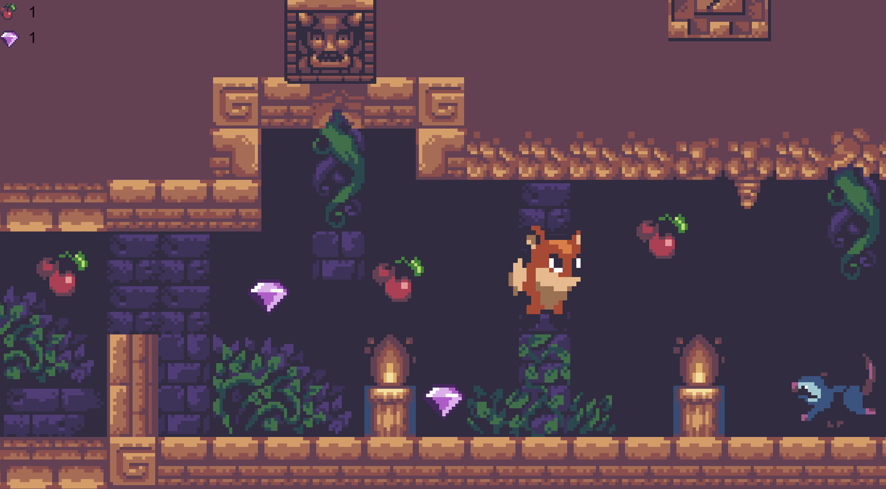

# PlatForm2D
Platform 2d for computer or mobile
Welcome to "Jungle Run", an exciting game built on Unity 2D! In this game, you take on the role of a fearless adventurer who must traverse through the dense jungle, facing numerous obstacles along the way.

Your mission is to navigate through the treacherous terrain by running and jumping your way through various obstacles, including obstacles such as trees, rocks, and rivers. But watch out! There are dangerous animals lurking around every corner that you'll need to avoid.
As you journey through the jungle, you'll discover an exciting and beautiful tile map filled with hidden secrets and treasures. But to unlock these secrets, you'll need to be quick on your feet and be able to jump over obstacles with precision.

With the help of physics 2D, coroutines, and randomization, the game offers unique gameplay every time you play it. I also learn about design patterns such as singleton pattern, prototype, and observer.

The game includes various Unity 2D features like tilemap, animation, animation controller, animation in code, prefabs, prefab variants, cinemachine, multilevel, level manager, and game UI, pushing game.

At the end of the game, you will get a score based on how quickly you completed each level and how many secrets did you get. You'll also receive an awesome gif as a reward for completing the game.

So put on your running shoes, grab your adventurer's hat, and join us on this epic journey through the jungle. Let's see if you have what it takes to become the ultimate "Jungle Runner"!

Link youtube: https://youtu.be/p9h-4AJn-v0